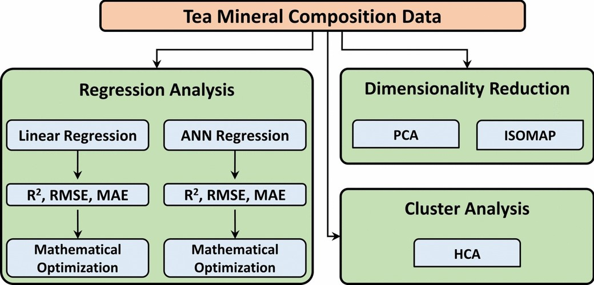

# ARIM-Academy：　機器データ利活用ユースケース
### タイトル：茶の抽出条件に関する機械学習/数学的最適化検討
### 機器：誘導結合プラズマ発光分光分析法（ICP-OES）
### 分析：回帰分析（線形重回帰分析、人工ニューラルネットワーク）,次元削減、クラスタ分析, TPE（数理最適化）

## データセット

    
本編で扱う 『茶の元素分析データセット』（data.xlsx）、は、ブラックセイロン(BC)、ブラックトルコ(BT)、グリーンセイロン(GC)、グリーントルコ(GT)の4種類の茶葉について、3つの濃度（1%、2%、3%）で抽出したサンプルの誘導結合プラズマ発光分光分析法（ICP-OES）の元素分析データです。[1]

この研究では、機械学習（回帰分析としてMLR, ANN、および主成分分析、ISOMAP、階層クラスタ分析など）の手法を使い、茶の品種、濃度、浸出時間によるミネラル組成の変化を調査し、特定のミネラルレベルを調整する条件を見つける検討が行われています。

[1] Durmus, Y., Atasoy, A.D. & Atasoy, A.F. Mathematical optimization of multilinear and artificial neural network regressions for mineral composition of different tea types infusions. Sci Rep 14, 18285 (2024). https://doi.org/10.1038/s41598-024-69149-1

---
   

  

---

**Chemical composition** 
* 9種類の元素分析値（Al, Ca, Cu, Fe,K,Mg,Mn,Na,Zn） 

**Experimental parameters**  
* Concentration：　お茶の濃度
* time:　抽出時間

**Label**
* grouped:　品種・色・濃度・抽出時間を識別できる一種の飼料名（MLは使用せず） 
* teaConc:　濃度ラベル（MLは使用せず）
* tea_org:　色ラベル（MLは使用せず）
* tea_var:　品種ラベル（MLは使用せず）
* tea：　　 色と品種ラベル（MLで使用）